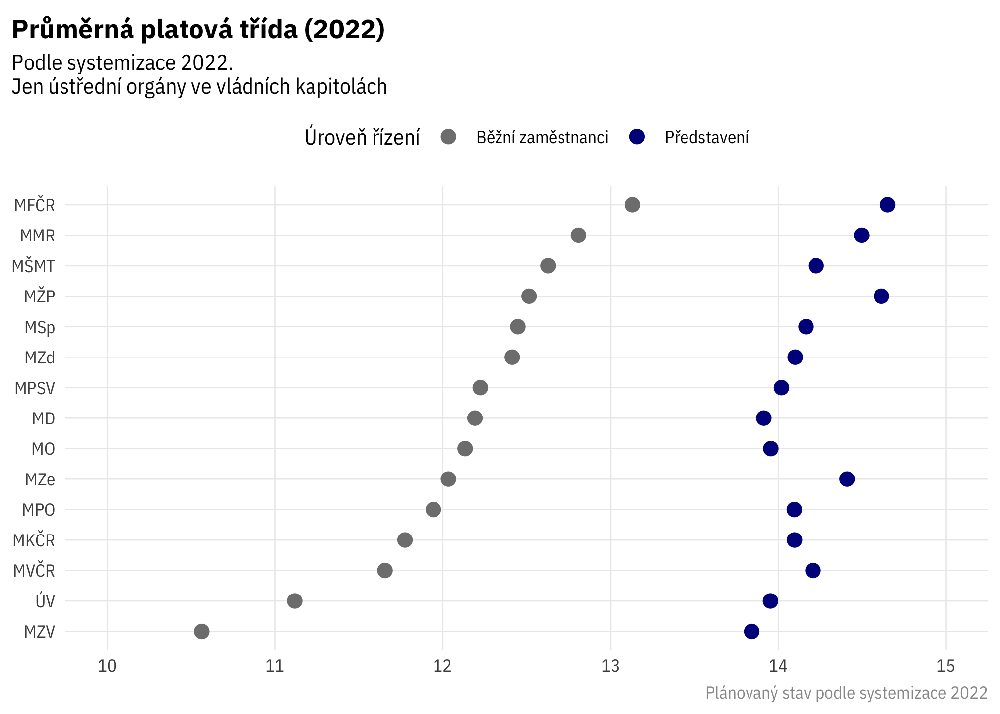

<!-- README.md is generated from README.Rmd. Please edit that file -->

# systemizace

<!-- badges: start -->
<!-- badges: end -->

This repository contains R code to download and process official data on
the organisation of public servants in the Czech central public
administration - “systemizace služebních míst”.

It works with two sources of data:

1.  The official tables
2.  Organisational structures published as [open
    data](https://data.gov.cz/datov%C3%A1-sada?iri=https%3A%2F%2Fdata.gov.cz%2Fzdroj%2Fdatov%C3%A9-sady%2F00007064%2F846439662)

### Official tables

The code downloads, loads and processes the published excel files such
that

- the data is in tidy format
- civil servants and employees are in one data frame
- pay grades (platové třídy) and management levels (představení) are
  correctly identified

See
<https://www.mvcr.cz/sluzba/clanek/systemizace-sluzebnich-a-pracovnich-mist.aspx>.
For [April 2022
edition](https://www.mvcr.cz/sluzba/clanek/zmena-systemizace-sluzebnich-a-pracovnich-mist-s-ucinnosti-od-1-dubna-2022.aspx),
only PDF table is provided.

Data currently available from 2018 to 2024.

#### Sample



Wide format

    # A tibble: 3,829 × 53
         rok kapitola_kod kapitola_zkr organizace_nazev         ustredni_organ vztah
       <int> <chr>        <chr>        <chr>                    <lgl>          <chr>
     1  2018 304          ÚV           Úřad vlády ČR            TRUE           sluz 
     2  2018 306          MZV          Ministerstvo zahraniční… TRUE           sluz 
     3  2018 307          MO           Ministerstvo obrany      TRUE           sluz 
     4  2018 307          MO           KVV hlavní město Praha   FALSE          sluz 
     5  2018 307          MO           KVV Praha – Středočeský… FALSE          sluz 
     6  2018 307          MO           KVV Plzeň                FALSE          sluz 
     7  2018 307          MO           KVV České Budějovice     FALSE          sluz 
     8  2018 307          MO           KVV Karlovy Vary         FALSE          sluz 
     9  2018 307          MO           KVV Ústí nad Labem       FALSE          sluz 
    10  2018 307          MO           KVV Hradec Králové       FALSE          sluz 
    # ℹ 3,819 more rows
    # ℹ 47 more variables: pocet_celkem <dbl>, plat_prumer <dbl>,
    #   pocet_predst <dbl>, pocet_predst_01 <dbl>, pocet_predst_02 <dbl>,
    #   pocet_predst_03 <dbl>, pocet_predst_04 <dbl>, pocet_predst_05 <dbl>,
    #   pocet_predst_06 <dbl>, pocet_predst_07 <dbl>, pocet_predst_08 <dbl>,
    #   pocet_predst_09 <dbl>, pocet_predst_10 <dbl>, pocet_predst_11 <dbl>,
    #   pocet_predst_12 <dbl>, pocet_predst_13 <dbl>, pocet_predst_14 <dbl>, …

Long format - staff numbers only

    # A tibble: 130,186 × 16
         rok kapitola_kod kapitola_zkr organizace_nazev ustredni_organ vztah
       <int> <chr>        <chr>        <chr>            <lgl>          <chr>
     1  2018 304          ÚV           Úřad vlády ČR    TRUE           sluz 
     2  2018 304          ÚV           Úřad vlády ČR    TRUE           sluz 
     3  2018 304          ÚV           Úřad vlády ČR    TRUE           sluz 
     4  2018 304          ÚV           Úřad vlády ČR    TRUE           sluz 
     5  2018 304          ÚV           Úřad vlády ČR    TRUE           sluz 
     6  2018 304          ÚV           Úřad vlády ČR    TRUE           sluz 
     7  2018 304          ÚV           Úřad vlády ČR    TRUE           sluz 
     8  2018 304          ÚV           Úřad vlády ČR    TRUE           sluz 
     9  2018 304          ÚV           Úřad vlády ČR    TRUE           sluz 
    10  2018 304          ÚV           Úřad vlády ČR    TRUE           sluz 
    # ℹ 130,176 more rows
    # ℹ 10 more variables: date <date>, kapitola_nazev <chr>,
    #   kapitola_vladni <lgl>, organizace_typ <chr>, kapitola_typ <chr>, src <chr>,
    #   level <chr>, trida <chr>, pocet <dbl>, level_nazev <chr>

### Organisational structures

These are now in a [separate
repository](https://github.com/petrbouchal/mapa-statu/).

### Technical: how to run this

Code organised as a {targets} pipeline, with packages tracked by {renv},
so can be reproduced like so:

``` r
renv::restore()
targets::tar_make()
```

Tidy data ready for analysis are in `data-export`. Codebook is TBA.

Rendered 2024-01-25 23:19:30.088474
