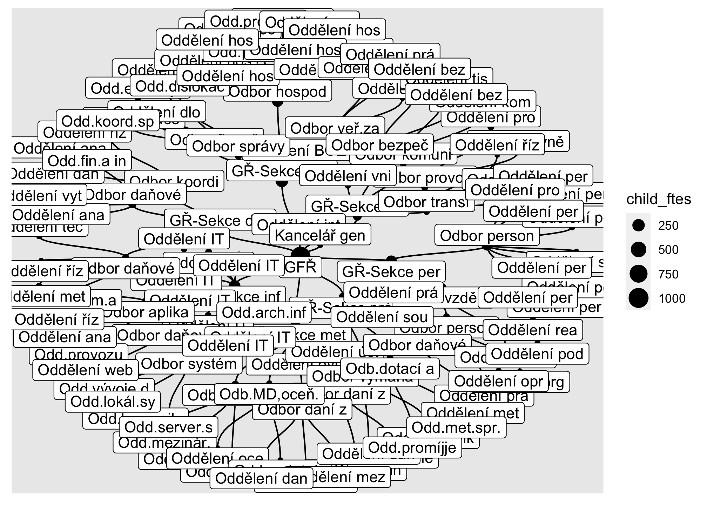

<!-- README.md is generated from README.Rmd. Please edit that file -->

# systemizace

<!-- badges: start -->
<!-- badges: end -->

This repository contains R code to download and process official data on
the organisation of public servants in the Czech central public
administration - “systemizace služebních míst”.

It works with two sources of data:

1.  The official tables
2.  Organisational structures published as [open
    data](https://data.gov.cz/datov%C3%A1-sada?iri=https%3A%2F%2Fdata.gov.cz%2Fzdroj%2Fdatov%C3%A9-sady%2F00007064%2F846439662)

### Official tables

The code downloads, loads and processes the published excel files such
that

-   the data is in tidy format
-   civil servants and employees are in one data frame
-   pay grades (platové třídy) and management levels (představení) are
    correctly identified

See
<https://www.mvcr.cz/sluzba/clanek/systemizace-sluzebnich-a-pracovnich-mist.aspx>.
For [April 2022
edition](https://www.mvcr.cz/sluzba/clanek/zmena-systemizace-sluzebnich-a-pracovnich-mist-s-ucinnosti-od-1-dubna-2022.aspx),
only PDF table is provided.

Data currently available from 2018 to 2022.

#### Sample

    Warning in mask$eval_all_mutate(quo): NAs introduced by coercion


Wide format

    # A tibble: 2,872 × 53
         rok kapitola_kod kapitola_zkr organizace_nazev          ustredni_organ vztah pocet_celkem plat_prumer
       <int> <chr>        <chr>        <chr>                     <lgl>          <chr>        <dbl>       <dbl>
     1  2018 304          ÚV           Úřad vlády ČR             TRUE           sluz           365      53627.
     2  2018 306          MZV          Ministerstvo zahraničníc… TRUE           sluz          1816      37804.
     3  2018 307          MO           Ministerstvo obrany       TRUE           sluz          1034      47871.
     4  2018 307          MO           KVV hlavní město Praha    FALSE          sluz             6      34901.
     5  2018 307          MO           KVV Praha – Středočeský … FALSE          sluz             6      34874.
     6  2018 307          MO           KVV Plzeň                 FALSE          sluz             6      35085.
     7  2018 307          MO           KVV České Budějovice      FALSE          sluz             6      34840.
     8  2018 307          MO           KVV Karlovy Vary          FALSE          sluz             6      32666.
     9  2018 307          MO           KVV Ústí nad Labem        FALSE          sluz             6      34166.
    10  2018 307          MO           KVV Hradec Králové        FALSE          sluz             6      34740.
    # … with 2,862 more rows, and 45 more variables: pocet_predst <dbl>, pocet_predst_01 <dbl>,
    #   pocet_predst_02 <dbl>, pocet_predst_03 <dbl>, pocet_predst_04 <dbl>, pocet_predst_05 <dbl>,
    #   pocet_predst_06 <dbl>, pocet_predst_07 <dbl>, pocet_predst_08 <dbl>, pocet_predst_09 <dbl>,
    #   pocet_predst_10 <dbl>, pocet_predst_11 <dbl>, pocet_predst_12 <dbl>, pocet_predst_13 <dbl>,
    #   pocet_predst_14 <dbl>, pocet_predst_15 <dbl>, pocet_predst_16 <dbl>, pocet_ostat <dbl>,
    #   pocet_ostat_01 <dbl>, pocet_ostat_02 <dbl>, pocet_ostat_03 <dbl>, pocet_ostat_04 <dbl>,
    #   pocet_ostat_05 <dbl>, pocet_ostat_06 <dbl>, pocet_ostat_07 <dbl>, pocet_ostat_08 <dbl>, …

Long format - staff numbers only

    # A tibble: 97,648 × 16
         rok kapitola_kod kapitola_zkr organizace_nazev ustredni_organ vztah date       kapitola_nazev
       <int> <chr>        <chr>        <chr>            <lgl>          <chr> <date>     <chr>         
     1  2018 304          ÚV           Úřad vlády ČR    TRUE           sluz  2018-01-01 Úřad vlády    
     2  2018 304          ÚV           Úřad vlády ČR    TRUE           sluz  2018-01-01 Úřad vlády    
     3  2018 304          ÚV           Úřad vlády ČR    TRUE           sluz  2018-01-01 Úřad vlády    
     4  2018 304          ÚV           Úřad vlády ČR    TRUE           sluz  2018-01-01 Úřad vlády    
     5  2018 304          ÚV           Úřad vlády ČR    TRUE           sluz  2018-01-01 Úřad vlády    
     6  2018 304          ÚV           Úřad vlády ČR    TRUE           sluz  2018-01-01 Úřad vlády    
     7  2018 304          ÚV           Úřad vlády ČR    TRUE           sluz  2018-01-01 Úřad vlády    
     8  2018 304          ÚV           Úřad vlády ČR    TRUE           sluz  2018-01-01 Úřad vlády    
     9  2018 304          ÚV           Úřad vlády ČR    TRUE           sluz  2018-01-01 Úřad vlády    
    10  2018 304          ÚV           Úřad vlády ČR    TRUE           sluz  2018-01-01 Úřad vlády    
    # … with 97,638 more rows, and 8 more variables: kapitola_vladni <lgl>, organizace_typ <chr>,
    #   kapitola_typ <chr>, src <chr>, level <chr>, trida <chr>, pocet <dbl>, level_nazev <chr>

### Organisational structures

This data is published as one large XML file for all “služební úřady”,
i.e. organisations governed by Služební zákon, the Civil Service Act. It
lists all organisational units within these organisations along their
unique and internal IDs, names, parents (subordinate) units and staff
counts (service an contract roles).

In practice:

-   some ministries do not break down their units to the lowest level
    (MZV and MV leave out the bottom level)
-   names and abbrevietations are inputted differently by different
    orgs - some list include numbers, some names are in fact
    abbreviations etc., which makes text searching difficult
-   staff counts are missing for most orgs and undocumented, i.e. it is
    not clear whether it is actual contracts (occupied slots) or slots
    regardless of whether they are occupied; also not clear if it is
    FTEs or headcount/position counts.

The code here transforms that data into

-   a graph and its components (nodes and edges) which forms a tree.
    This can be analysed in R via packages that can work with graphs
    (e.g. tidygraph, ggraph) or in other tools using the tables of nodes
    and edges (visNetwork)
-   a hierarchical table, listing all units, where each row denotes a
    units lowest in the hierarchy and columns list all its parents, one
    level per column. This is useful for search or for visualisation
    using e.g. D3network, tree mark in Observable Plot or the
    CollapsibleTree package.

This data is exported as CSV in data-export

For more info on data on public servants see [recent
report](https://idea.cerge-ei.cz/zpravy/statni-zamestnanci-a-urednici-kde-pracuji-a-za-kolik)
and [related repo](https://github.com/dan-bart/urednici_2021), plus an
[older overview of available
sources](https://petrbouchal.xyz/urednici/).

#### Preview



Graph

    # A tbl_graph: 9018 nodes and 9017 edges
    #
    # A rooted tree
    #
    # Edge Data: 9,017 × 2 (active)
       from    to
      <int> <int>
    1  9018     1
    2     1     2
    3     1     3
    4     1     4
    5     1     5
    6     1     6
    # … with 9,011 more rows
    #
    # Node Data: 9,018 × 13
      name  nazev mista_prac mista_sluz predstaveny id_ext urad_zkratka urad_nazev zkratka urad_skupina
      <chr> <chr>      <dbl>      <dbl> <chr>       <chr>  <chr>        <chr>      <chr>   <chr>       
    1 1100… Úřad…          0          0 <NA>        1      ÚV ČR        Úřad vlád… ÚV ČR   Ministerstv…
    2 1200… Odbo…          0          0 <NA>        240100 ÚV ČR        Úřad vlád… OLP     <NA>        
    3 1200… Oddě…          0          0 <NA>        220330 ÚV ČR        Úřad vlád… OVB     <NA>        
    # … with 9,015 more rows, and 3 more variables: mista_celkem <dbl>, dpth <int>, child_ftes <dbl>

Nodes

    # A tibble: 9,018 × 13
       id       nazev    mista_prac mista_sluz predstaveny id_ext urad_zkratka urad_nazev zkratka urad_skupina
       <chr>    <chr>         <dbl>      <dbl> <chr>       <chr>  <chr>        <chr>      <chr>   <chr>       
     1 11000002 Úřad vl…          0          0 <NA>        1      ÚV ČR        Úřad vlád… ÚV ČR   Ministerstv…
     2 12003123 Odbor l…          0          0 <NA>        240100 ÚV ČR        Úřad vlád… OLP     <NA>        
     3 12003104 Oddělen…          0          0 <NA>        220330 ÚV ČR        Úřad vlád… OVB     <NA>        
     4 12003134 Odbor r…          0          0 <NA>        240300 ÚV ČR        Úřad vlád… RRP     <NA>        
     5 12003088 Předsed…          0          0 <NA>        200000 ÚV ČR        Úřad vlád… KPV     <NA>        
     6 12012228 Ministr…          0          0 <NA>        300000 ÚV ČR        Úřad vlád… MLRV    <NA>        
     7 12012287 Místopř…          0          0 <NA>        800000 ÚV ČR        Úřad vlád… MDG     <NA>        
     8 12003153 Ministr…          0          0 <NA>        500000 ÚV ČR        Úřad vlád… MVVI    <NA>        
     9 12012281 Ministr…          0          0 <NA>        700000 ÚV ČR        Úřad vlád… MEZ     <NA>        
    10 12011241 Odd. Se…          0          0 <NA>        100040 ÚV ČR        Úřad vlád… SVÚ     <NA>        
    # … with 9,008 more rows, and 3 more variables: mista_celkem <dbl>, dpth <int>, child_ftes <dbl>

Edges

    # A tibble: 9,017 × 2
       from     to      
       <chr>    <chr>   
     1 stat     11000002
     2 11000002 12003123
     3 11000002 12003104
     4 11000002 12003134
     5 11000002 12003088
     6 11000002 12012228
     7 11000002 12012287
     8 11000002 12003153
     9 11000002 12012281
    10 11000002 12011241
    # … with 9,007 more rows

Table

    # A tibble: 6,865 × 14
       level1_id level1_nazev  level2_id level2_nazev  level3_id level3_nazev level4_id level4_nazev level5_id
       <chr>     <chr>         <chr>     <chr>         <chr>     <chr>        <chr>     <chr>        <chr>    
     1 11000002  Úřad vlády ČR 12003123  Odbor lidský… 12003124  Sekretariát… <NA>      <NA>         <NA>     
     2 11000002  Úřad vlády ČR 12003123  Odbor lidský… 12003125  Kanc. Rady … <NA>      <NA>         <NA>     
     3 11000002  Úřad vlády ČR 12003123  Odbor lidský… 12012172  Odd. sekr. … <NA>      <NA>         <NA>     
     4 11000002  Úřad vlády ČR 12003123  Odbor lidský… 12003126  Sekr. Vl. v… <NA>      <NA>         <NA>     
     5 11000002  Úřad vlády ČR 12003104  Oddělení vni… <NA>      <NA>         <NA>      <NA>         <NA>     
     6 11000002  Úřad vlády ČR 12003134  Odbor rovnos… 12003136  Oddělení pr… <NA>      <NA>         <NA>     
     7 11000002  Úřad vlády ČR 12003134  Odbor rovnos… 12003135  Sekretariát… <NA>      <NA>         <NA>     
     8 11000002  Úřad vlády ČR 12003088  Předseda vlá… 12003100  Odbor proti… 12003102  Národní mon… <NA>     
     9 11000002  Úřad vlády ČR 12003088  Předseda vlá… 12003100  Odbor proti… 12003101  Odd. koord.… <NA>     
    10 11000002  Úřad vlády ČR 12003088  Předseda vlá… 12003106  Sekretariát… <NA>      <NA>         <NA>     
    # … with 6,855 more rows, and 5 more variables: level5_nazev <chr>, level6_id <chr>, level6_nazev <chr>,
    #   mista_sluz <dbl>, mista_prac <dbl>

### Technical: how to run this

Code organised as a {targets} pipeline, with packages tracked by {renv},
so can be reproduced like so:

``` r
renv::restore()
targets::tar_make()
```

Tidy data ready for analysis are in `data-export`. Codebook is TBA.

Rendered 2022-05-19 23:24:49
